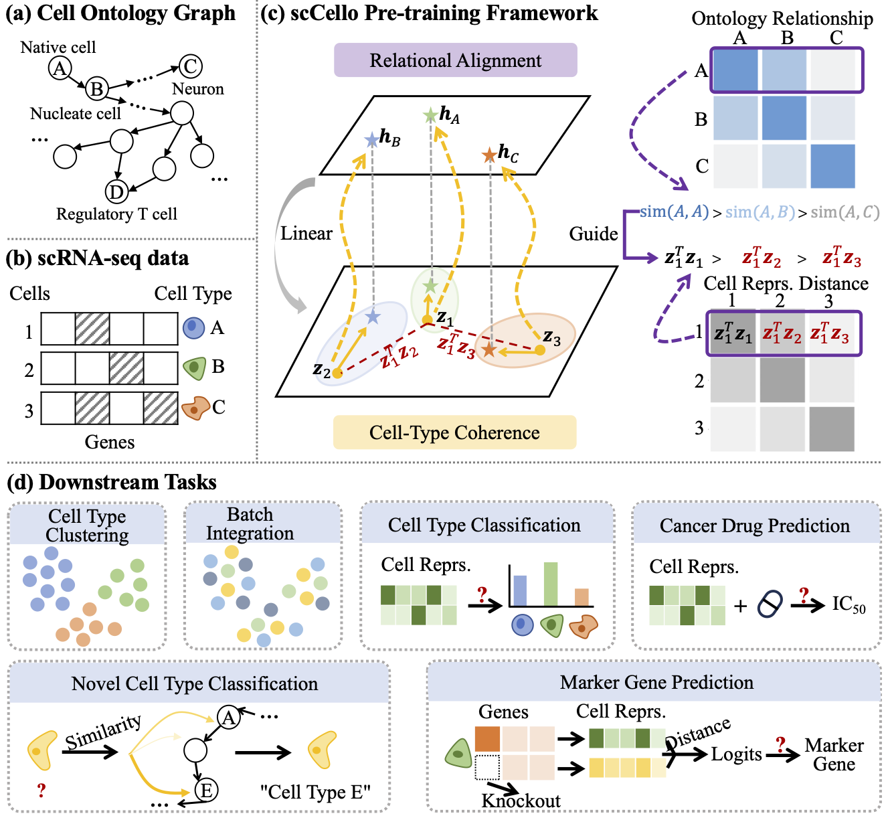

<div align="center">

# scCello: Cell-ontology Guided Transcriptome Foundation Model

[](https://pytorch.org/get-started/locally/)
[](https://arxiv.org/abs/2408.12373)
[](https://huggingface.co/collections/katarinayuan/sccello-67a01b6841f3658ba443c58a)


</div>

PyTorch implementation of [scCello], a cell-ontology guided transcriptome foundation model (TFM) for single cell RNA-seq data. Authored by [Xinyu Yuan], and [Zhihao Zhan].

[Xinyu Yuan]: https://github.com/KatarinaYuan
[Zhihao Zhan]: https://github.com/zhan8855
[scCello]: https://github.com/DeepGraphLearning/scCello

## Overview ##

scCello enhances transcriptome foundation models (TFMs) by integrating cell ontology graphs into pre-training, addressing the limitation of treating cells as independent entities. By incorporating cell-level objectives: **cell-type coherence loss** and **ontology alignment loss**, scCello demonstrate superior or competitive generalization and transferability capability over the existing TFMs on biologically important tasks including identifying novel cell types of unseen cells, prediction of cell-type-specific marker genes, and cancer drug responses.

This repository is based on PyTorch 2.0 and Python 3.9.



Table of contents:
* [Features](#features)
* [Updates](#updates)
* [Installation](#installation)
* [Download](#download)
    * [Model checkpoints](#model-checkpoints)
    * [Pre-training and downstream datasets](#pre-training-and-downstream-datasets)
    * [Example h5ad data](#example-h5ad-data)
* [Usage](#usage)
    * [h5ad data format transformation](#h5ad-data-format-transformation)
    * [Downstream generalization](#downstream-generalization)
         * [Cell type clustering & batch integration](#cell-type-clustering--batch-integration)
         * [Cell type classification](#cell-type-classification)
         * [Novel cell type classification](#novel-cell-type-classification)
    * [Downstream transferability](#downstream-transferability)
         * [Marker gene prediction](#marker-gene-prediction)
         * [Cancer drug response prediction](#cancer-drug-response-prediction)
    * [Pre-training](#pre-training)
* [Citation](#citation)

## Features ##
* **Cell-type Specific Learning**: Utilizes cell-type coherence loss to learn specific gene expression patterns relevant to each cell type.
* **Ontology-aware Modeling**: Employs ontology alignment loss to understand and preserve the hierarchical relationships among different cell types.
* **Large-scale Pre-training**: Trained on over 22 million cells from the CellxGene database, ensuring robust and generalizable models.
* **Advanced Generalization and Transferability**: Demonstrates superior performance on various biologically significant tasks such as identifying novel cell types and predicting cell-type-specific marker genes.


## Updates
* **Feb 5th, 2025**: scCello code released!
* **Oct 1st, 2024**: scCello got accepted at NeurIPS 2024!
* **Aug 22nd, 2024**: scCello preprint release on arxiv!

## Installation ##

You may install the dependencies via the following bash command. 

```bash
conda install pytorch==2.0.1 pytorch-cuda=11.7 -c pytorch -c nvidia
pip install transformers[torch]
pip install easydict
pip install psutil
pip install wandb
pip install pytz
pip install ipdb
pip install pandas
pip install datasets
pip install torchmetrics
pip install rdflib
pip install hickle
pip install anndata
pip install scikit-learn
pip install scanpy
pip install scib
conda install -c conda-forge cupy
conda install rapidsai::cuml
conda install -c rapidsai -c conda-forge -c nvidia cugraph
```


## Download ##
### Model Checkpoints ###

Quick start guide to load scCello checkpoint:
* for zero-shot inference tasks
```
from sccello.src.model_prototype_contrastive import PrototypeContrastiveForMaskedLM

model = PrototypeContrastiveForMaskedLM.from_pretrained("katarinayuan/scCello-zeroshot", output_hidden_states=True)
```

* for linear probing tasks (see details in sccello/script/run_cell_type_classification.py)
```
from sccello.src.model_prototype_contrastive import PrototypeContrastiveForSequenceClassification

model_kwargs = {
    "num_labels": NUM_LABELS, # number of labels for classification
    "total_logging_steps": training_cfg["logging_steps"] * training_args.gradient_accumulation_steps,
}

model = PrototypeContrastiveForSequenceClassification.from_pretrained("katarinayuan/scCello-zeroshot", **model_kwargs)
```
### Pre-training and Downstream Datasets ###
For downstreams, in-distribution (ID) data $D^{id}$ and out-of-distribution (OOD) data across cell type $\{D_i^{ct}\}|i\in{1,2}$, tissue $\{D_i^{ts}\}|i\in{1,2}$ and donors $\{D_i^{dn}\}|i\in{1,2}$ are summarized (see App. B for data preprocessing details.)


```
# Note that some datasets are extremely large, use the following command to change data caching directory. The default is "~/.cache/huggingface/datasets/".
export HF_HOME="/path/to/another/directory/datasets"

from sccello.src.utils import data_loading

# pre-training data & D^{id}
train_dataset = load_dataset("katarinayuan/scCello_pretrain_unsplitted")["train"]
train_dataset, indist_test_data = train_dataset.train_test_split(test_size=0.001, seed=237) # seed used in scCello

# D_1^{ct} & D_2^{ct}
d1_ct, d2_ct = data_loading.get_fracdata("celltype", "frac100", False, False)

# D_1^{ts} & D_2^{ts}
d1_ts, d2_ts = data_loading.get_fracdata("tissue", "frac100", False, False)

# D_1^{dn} & D_2^{dn}
d1_dn, d2_dn = data_loading.get_fracdata("donor", "frac100", False, False)

```

### Example h5ad data ###
Example data for transforming h5ad format to huggingface format.
For building pre-training datasets and downstream datasets, we downloaded a series of human h5ad data from [CellxGene](https://chanzuckerberg.github.io/cellxgene-census/)
```bash
pip install gdown
cd ./data/example_h5ad/
gdown https://drive.google.com/uc?id=1UsbkhmZwSDWTgY4die60fHvzL_FnXtWE
```

## Usage ##
The `sccello/script` folder contains all executable files.

General configurations:
```
pretrained_ckpt=katarinayuan/scCello-zeroshot
output_dir=/home/xinyu402/single_cell_output/
wandb_run_name=test
```

### h5ad Data Format Transformation ###

```
python ./sccello/script/run_data_transformation.py 
```

### Downstream Generalization ###

#### Cell Type Clustering & Batch Integration ####

```
python ./sccello/script/run_cell_type_clustering.py --pretrained_ckpt  $pretrained_ckpt --wandb_run_name $wandb_run_name --output_dir $output_dir
```


#### Cell Type Classification ####
```
# Linear Probing
training_type=linear_probing
# or Train from Scratch without Loading the Pre-trained Model
# training_type=from_scratch_linear

torchrun ./sccello/script/run_cell_type_classification.py --pretrained_ckpt $pretrained_ckpt --training_type $training_type --wandb_run_name $wandb_run_name --further_downsample 0.01 --output_dir $output_dir
```

#### Novel Cell Type Classification ####
```
python ./sccello/script/run_novel_cell_type_classification.py --pretrained_ckpt $pretrained_ckpt --wandb_run_name $wandb_run_name --indist_repr_path ./embedding_storage/cellreprs_indist_frac_celltype_data1.pkl --output_dir $output_dir
```

### Downstream Transferability ###
#### Marker Gene Prediction ####
```
python ./sccello/script/run_marker_gene_prediction.py --pretrained_ckpt $pretrained_ckpt --wandb_run_name $wandb_run_name --output_dir $output_dir
```

#### Cancer Drug Response Prediction ####
```
python ./sccello/script/run_cancer_drug_response.py --pretrained_ckpt $pretrained_ckpt --wandb_run_name $wandb_run_name
```

### Pre-training ###
```
python -m torch.distributed.run --nproc_per_node=1 ./sccello/script/run_pretrain_prototype_contrastive.py --wandb_run_name pretrain_test 
```

## Citation ##

If you find this codebase useful in your research, please cite the original papers.

The main scCello paper:

```bibtex
@inproceedings{yuancell,
  title={Cell ontology guided transcriptome foundation model},
  author={Yuan, Xinyu and Zhan, Zhihao and Zhang, Zuobai and Zhou, Manqi and Zhao, Jianan and Han, Boyu and Li, Yue and Tang, Jian},
  booktitle={The Thirty-eighth Annual Conference on Neural Information Processing Systems}
}
```
